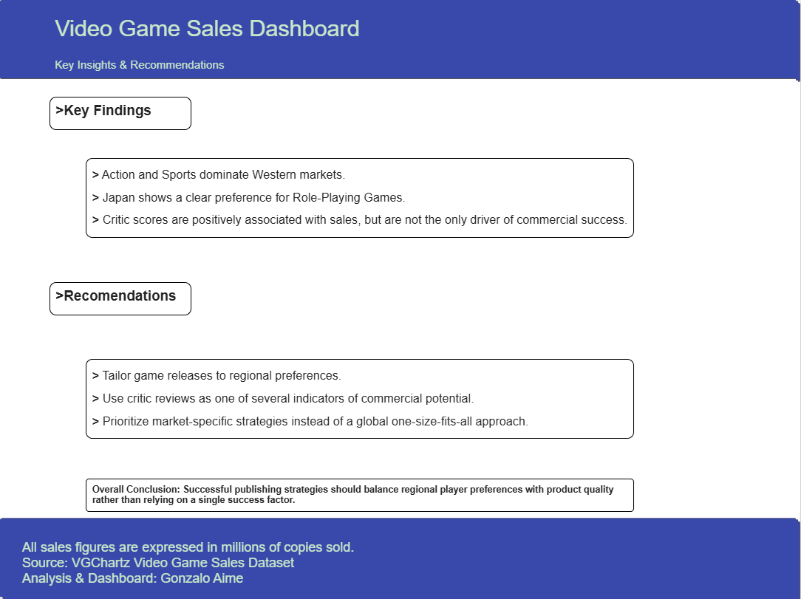

# 🎮 Video Game Sales Analytics

An end-to-end data analytics project exploring worldwide video game sales through data cleaning, exploratory analysis, feature engineering, and interactive dashboard development using Python, Pandas, and Looker Studio.

---

# 📌 Project Overview

This project analyzes worldwide video game sales to identify market trends, evaluate the relationship between critic scores and commercial performance, and compare player preferences across different regions.

The project follows a complete analytics workflow, from raw data preparation to the development of an interactive business dashboard.

---

# 🎯 Objectives

- Clean and prepare raw video game sales data.
- Explore sales trends across different regions.
- Analyze the relationship between critic scores and sales performance.
- Identify genre preferences by region.
- Build an interactive dashboard to communicate findings.

---

# 🔄 Project Workflow

```
Raw Dataset
      │
      ▼
Data Cleaning (Python & Pandas)
      │
      ▼
Exploratory Data Analysis
      │
      ▼
Feature Engineering
      │
      ▼
Interactive Dashboard (Looker Studio)
      │
      ▼
Business Insights & Recommendations
```

---

# 📂 Dataset

**Source:** VGChartz Video Game Sales Dataset

The dataset contains approximately **39,800 video games**, including information about:

- Game Title
- Platform
- Genre
- Publisher
- Developer
- Critic Score
- Regional Sales
- Global Sales
- Release Date

---

# 🛠️ Tools & Technologies

| Tool | Purpose |
|------|---------|
| Python | Data cleaning & preprocessing |
| Pandas | Data manipulation |
| Jupyter Notebook | Exploratory Data Analysis |
| Looker Studio | Interactive dashboard |
| Git | Version control |
| GitHub | Portfolio & project hosting |

---

# 📁 Repository Structure

```
Video-Game-Sales/
│
├── Dashboard/
│   ├── Executive Overview.png
│   ├── Game Performance Explorer.png
│   ├── Critic Scores vs Sales.png
│   ├── pRegional Sales Preferencesage4.png
│   └── Insights.png
│
├── 01_exploratory_data_analysis.ipynb
├── 02-data_dictionary.ipynb
├── 03-data_enrichment.ipynb
├── 04-data_cleanning.ipynb
├── 05-changing_data_types.ipynb
│
├── vgchartz2024.csv
├── vgchartz_enriched.csv
├── vgchartz_cleaned.csv
│
├── requirements.txt
└── README.md
```

---

# 📊 Interactive Dashboard

The dashboard was developed in **Looker Studio** to transform the analytical findings into an interactive business intelligence report.

***

## 📊 Executive Overview

Provides a high-level summary of the global video game market.

<p align="center">
  
</p>

***

## 🎮 Game Performance Explorer

Explore individual game performance using interactive filters for console, genre, publisher, and developer.

<p align="center">
  
</p>

***

## ⭐ Critic Score Analysis

Explores whether higher critic scores are associated with stronger commercial performance.

<p align="center">
  
</p>

***

## 🌍 Regional Genre Preferences

Compare the best-performing genres across North America, Europe, Japan, and Other Regions.

<p align="center">
  
</p>

***

## 💡 Key Insights & Recommendations

Summarizes the main findings of the analysis and presents business-oriented recommendations supported by the data.

<p align="center">
  
</p>

# 🌐 Live Dashboard

Explore the interactive version of the dashboard in Looker Studio:

🔗 **[Open Interactive Dashboard](https://datastudio.google.com/reporting/43d31962-e432-416b-8282-5140bfe0f2f8)**